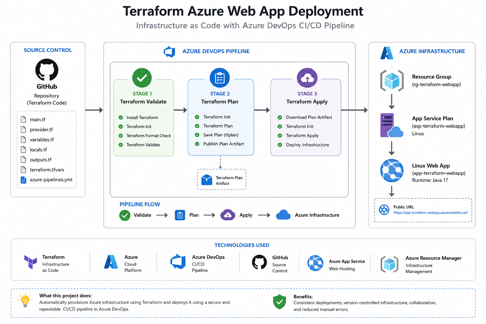

# 🚀 Terraform Azure Web App Deployment

## 📖 Overview

This project demonstrates how to provision Azure infrastructure using **Terraform** and automate deployments using a **multi-stage Azure DevOps YAML pipeline**.

The infrastructure is deployed into Microsoft Azure using Infrastructure as Code (IaC) and includes:

- Azure Resource Group
- Azure App Service Plan
- Azure Linux Web App

The project also demonstrates a professional CI/CD workflow including validation, planning and deployment.

---

# 🏗️ Architecture



---

# ⚙️ Technologies Used

| Technology | Purpose |
|------------|---------|
| Terraform | Infrastructure as Code |
| Azure | Cloud Platform |
| Azure DevOps | CI/CD Pipelines |
| GitHub | Source Control |
| Azure App Service | Web Hosting |
| Azure Resource Manager | Infrastructure Management |

---

# 📁 Project Structure

```text
terraform-azure-webapp/
│
├── provider.tf
├── variables.tf
├── locals.tf
├── main.tf
├── outputs.tf
├── terraform.tfvars
├── azure-pipelines.yml
├── architecture.png
└── README.md
```

---

# 🚀 Azure Resources Created

Terraform provisions the following Azure resources:

- Resource Group
- App Service Plan
- Linux Web App

---

# 🔄 Azure DevOps Pipeline

The pipeline contains three stages.

## Stage 1

Terraform Validate

Tasks:

- Install Terraform
- Terraform Init
- Terraform Format Check
- Terraform Validate

---

## Stage 2

Terraform Plan

Tasks:

- Terraform Init
- Terraform Plan
- Publish Terraform Plan Artifact

---

## Stage 3

Terraform Apply

Tasks:

- Download Terraform Plan
- Terraform Apply
- Deploy Azure Infrastructure

---

# 📊 Pipeline Workflow

```text
GitHub
    │
    ▼
Azure DevOps
    │
    ▼
Terraform Validate
    │
    ▼
Terraform Plan
    │
    ▼
Terraform Apply
    │
    ▼
Azure Resource Group
    │
    ▼
Azure App Service Plan
    │
    ▼
Azure Linux Web App
```

---

# 📸 Pipeline Screenshot

*(Add your successful pipeline screenshot here.)*

Example:

```
screenshots/pipeline-success.png
```

---

# ▶️ How to Run

Clone the repository

```bash
git clone https://github.com/blueberry247/terraform-azure-webapp.git
```

Initialise Terraform

```bash
terraform init
```

Validate

```bash
terraform validate
```

Generate a plan

```bash
terraform plan
```

Deploy

```bash
terraform apply
```

Destroy resources

```bash
terraform destroy
```

---

# 📚 Skills Demonstrated

- Infrastructure as Code (IaC)
- Terraform
- Azure App Service
- Azure Resource Groups
- Azure DevOps
- YAML Pipelines
- Multi-stage Pipelines
- Azure Service Connections
- Git
- GitHub
- CI/CD

---

# 🚀 Future Improvements

- Remote Terraform State
- Azure Storage Backend
- State Locking
- Manual Approval Gates
- Dev / Test / Production Environments
- Reusable YAML Templates

---

# 👤 Author

**Mohammed Farooq**

DevOps Engineer

GitHub:

https://github.com/blueberry247